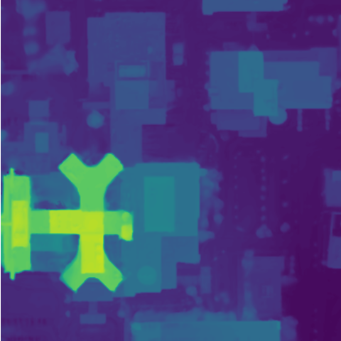

<div align="center">

# EOGS++: Earth Observation Gaussian Splatting with Internal Camera Refinement and Direct Panchromatic Rendering


[](https://github.com/pre-commit/pre-commit)
[](https://pytorch.org/get-started/locally/)

Official implementation for
<br>
[EOGS++: Earth Observation Gaussian Splatting with Internal Camera Refinement and Direct Panchromatic Rendering ](https://arxiv.org/abs/2511.16542)

[](https://arxiv.org/pdf/2511.16542)
[](https://gardiens.github.io/eogs2)


[🌍  Project webpage](https://gardiens.github.io/EOGS2/)
```
@article{bournez2025eogsearthobservationgaussian,
  title={EOGS++: Earth Observation Gaussian Splatting with Internal Camera Refinement and Direct Panchromatic Rendering},
  author={Bournez, Pierrick and Savant Aira, Luca and Ehret, Thibaud and Facciolo, Gabriele},
  journal={arXiv preprint arXiv:2511.16542},
  year={2025},
  url={https://arxiv.org/abs/2511.16542}
}
```


## 📌  Description
</div>

<p align="center">
  
</p>

<br>
EOGS++ is an enhanced Gaussian Splatting 🌍✨ framework designed specifically for satellite photogrammetry. It streamlines 3D reconstruction from multi-view satellite imagery by removing heavy preprocessing steps and improving the geometric accuracy of the final DSMs.

This updated version incorporates several key improvements over the original EOGS method. First, it introduces an internal camera-refinement mechanism based on optical flow 🌀, which corrects pose inaccuracies directly during training—no external bundle adjustment software required. It also shows that raw panchromatic imagery is sufficient for high-quality 3D reconstruction, eliminating the need for pansharpening.

On the training side, EOGS++ integrates opacity reset and early stopping ⚡ to sharpen the reconstruction while avoiding degradation due to over-regularization. A TSDF-based postprocessing step ensures explicit multi-view depth consistency, resulting in cleaner geometry and fewer floaters.

## 💻  Environment requirements

This project was tested with:

- Linux OS
 NVIDIA GeForce RTX 3090 **24G**
- CUDA 11.8 and CUDA 12.1
- conda 23.3.1

<br>

## 🏗 Installation

To set up the project, start by creating a dedicated Conda environment named **eogsplus**:

```bash
conda create -n eogsplus python=3.9 -y
conda activate eogsplus

# Install system dependencies required by some extensions
sudo apt-get install libtiff-dev libpng-dev libwebp-dev libglm-dev

# Install the project
bash install.sh

```


## 🚀  Usage

### 📦 Datasets

Download the dataset from the **GitHub Release page**:

➡️ https://github.com/mezzelfo/EOGS/releases/download/dataset_v01/data.zip

Extract it into the `data` folder :

```bash
unzip -q data.zip -d data
```


The structure should look like this:
```
EOGS/
├── data/
│ ├── images/
│ │ ├── pan/ # Panchromatic images
│ │ │ └── JAX_004/
│ │ ├── msi/ # Low-resolution MSI images
│ │ │ └── JAX_004/
│ │ ├── pansharpen/ # Pansharpened images
│ │ │ └── JAX_004/
│
│ ├── rpcs/
│ │ ├── rpc_ba/ # Bundle-adjusted RPCs
│ │ │ └── JAX_004/
│ │ │ └── JAX_004_006_RGB.json
│ │ ├── rpc_raw/ # Raw RPCs
│ │ │ └── JAX_004/
│ │ │ └── JAX_004_006_RGB.json
│ │ └── JAX_068/
│
│ ├── truth/ # Ground-truth DSM + optional masks
│ ├── train_test_split/ # Train/test split per scene
│ │ └── JAX_004/
│ │ └── train.txt

```

Next, generate the affine approximations of the camera models for all the scenes:
```bash
bash to_affine.sh

```


### 🧠 Training EOGS++

Run the following command to train **EOGS++** on a 24 GB GPU:

```bash
python src/gaussiansplatting/full_eval_pan.py experiments=<experiment> mode=<image_mode> rpc_type=<camera_type> scene=<scene_name>

```

Some example:

```bash
# Train EOGS++ on MSI data with raw RPC cameras (scene: JAX_068)
python src/gaussiansplatting/full_eval_pan.py experiments=eogsplus.yaml mode=onlyMSI rpc_type=rpc_raw scene=JAX_068

# Train EOGS++ on PAN data with bundle-adjusted RPC cameras (scene: IARPA_001)
python src/gaussiansplatting/full_eval_pan.py experiments=eogsplus.yaml mode=3PAN rpc_type=rpc_ba scene=IARPA_001
```

To reproduce all experiments from the paper:

```bash
bash experiments/reproduce_main.sh
```

All experiments generate reconstructed images inside `outputs/EXPNAME/`, and the corresponding DSMs in `outputs/EXPNAME/test_opNone/ours_X/rdsm/`.


## 🧩 Training With Your Own Data
All datasets and training logs are stored inside the data/ directory by default.
To add a new scene, follow the same directory structure as the existing datasets, choose a scene name, and generate the affine camera approximations:
```bash
rpc_type=rpc_raw
mode=pan
python -m scripts.dataset_creation.to_affine scene_name=MY_SCENE rpc_type=${rpc_type} mode=${mode}
```

Once the scene is prepared, you can directly train EOGS++:
```bash
python src/gaussiansplatting/full_eval_pan.py experiments=eogsplus mode=onlyMSI rpc_type=rpc_raw scene=MY_SCENE
```

## 💳  Credits

- This project was built using the [original EOGS github ](https://github.com/mezzelfo/EOGS/tree/master).
- The documentation was heavily inspired by the [SuperPoint Transformers github](https://github.com/drprojects/superpoint_transformer)


<br>

## Citing our work

If your work uses all or part of the present code, please include the following a citation:
```
@article{bournez2025eogsearthobservationgaussian,
  title={EOGS++: Earth Observation Gaussian Splatting with Internal Camera Refinement and Direct Panchromatic Rendering},
  author={Bournez, Pierrick and Savant Aira, Luca and Ehret, Thibaud and Facciolo, Gabriele},
  journal={arXiv preprint arXiv:2511.16542},
  year={2025},
  url={https://arxiv.org/abs/2511.16542}
}
```

You can find our [paper on arxiv 📄](https://arxiv.org/abs/2511.16542).